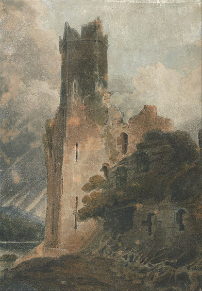

All mistakes spread a light
###########################

:date: 2020-10-3
:tags: link, story
:slug: all_mistakes_spread_a_light
:author: Tomas Parzen
:lang: en

"Once a time upon, was a village there ... what?!! The chamberlain was shocked. He was the third jester that messes all the words up. There was maybe something wrong in the court? For sure witchcraft! He heard other people have insane conversations, with dogs chased by cats and adjectives used as nouns. There was no time to think, and the king had to be noticed. He ran up the staircase to the royal rooms, where his majesty was preparing an Italian meal in leisure time. But even there something was wrong, terribly wrong! The oil was frying in the boiler, the eggs smashed with the wine and all others ingredients confused! He looked at the book, and the recipe was clear, but the king was gazing up and down, reading right to the left. 
 
The chamberlain, panicking, closed the door and stepped to the tower, where the wizard dwells. 
"Merlino!" he shouted "help us, cannot anymore language, we use! Confused are words!". Hearing these sounds, he jumped off his chair then opened his door and invited him to sit down. Merlino carefully inspected his mouth and ears, then went to the king, and he examined his eyes. But everything was apparently right, and another twist to the mystery! 

 
Merlino studied Linguistic at Wizards' Academy, so spent hours in the tower, towered by books, recollecting his wisdom, hoping to solve the puzzle. He sketched a mass of syntactic trees and asked the sphere of neural networks, but nothing could help the despair of the chamberlain.
The end was near when his young apprentice came up with an idea! 
She stood up and walked to the library, jumped on the ladder and caught the big book from Dr Hagoorten, Language and the brain.
Maybe, she proposed, "these people have nothing wrong in their voice or their eyes", perhaps, she insisted, "we have to look at what is going wrong in their heads!". Great idea, Merlino said, grasped the wand and suddenly spelt: "F.M.R.I, clear me the mind, E.E.G. shall the brain I see!" 
Magically, the head of the chamberlain started to turn pale, and then transparent, and they could see his thoughts moving fast on the pink jelly. When he looked at the mirror and, marvelled, asked what was happening, his brain sparkled of white light, which expanded through-out his transparent skull. The light blobs glared furiously and travelled back and forth at the rhythm of his own words. As the Hagoorten wrote, those lights were guiding his tongue to produce the right sounds and not the other way around. Unfortunately, the proper association between the luminous pathways and his odd syntactic mistakes was far from being understood. As well, the spell to tidy up the minds of the king and the jesters was still not invented. Science has its limits!

For this reason, Merlino and Marieke are sitting in the tower, flipping through the book and making simple questions to the chamberlain. They begin to understand how words connect to glaring lights, but much is to discover, and the king is still roasting the butter and spreading the beef! 

